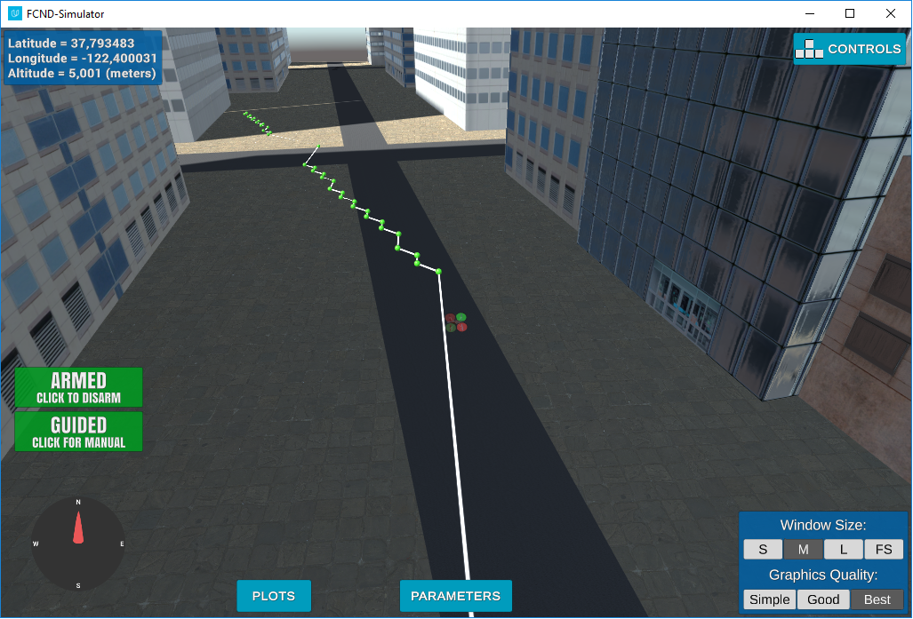

## Project: 3D Motion Planning

---


# Required Steps for a Passing Submission:
1. Load the 2.5D map in the colliders.csv file describing the environment.
2. Discretize the environment into a grid or graph representation.
3. Define the start and goal locations.
4. Perform a search using A* or other search algorithm.
5. Use a collinearity test or ray tracing method (like Bresenham) to remove unnecessary waypoints.
6. Return waypoints in local ECEF coordinates (format for `self.all_waypoints` is [N, E, altitude, heading], where the drone’s start location corresponds to [0, 0, 0, 0].
7. Write it up.
8. Congratulations!  Your Done!

## [Rubric](https://review.udacity.com/#!/rubrics/1534/view) Points
### Here I will consider the rubric points individually and describe how I addressed each point in my implementation.  

---
### Writeup / README

#### 1. Provide a Writeup / README that includes all the rubric points and how you addressed each one.  You can submit your writeup as markdown or pdf.  

You're reading it! Below I describe how I addressed each rubric point and where in my code each point is handled.

### Explain the Starter Code

#### 1. Explain the functionality of what's provided in `motion_planning.py` and `planning_utils.py`

These scripts contain a basic planning implementation.
The file 'planning_utils_py' has the following functions:

* create_grid() . It returns a grid representation of a 2D configuration space  based on given obstacle data, drone altitude and safety distance   arguments.
* valid_actions(). It returns a list of valid actions given a grid and current node.
* a_star(). It returns the path calculated using the A* algorithm
* heuristic(). It returns a metric of how close a point is to the goal.

There is also class Action that is used as an enum to define the available step directions and their weight.

The file `motion_planning.py` contains the classes needed to fly the drone.
The States due the execution of the application are:
MANUAL -> ARMING -> PLANNING-> TAKEOFF -> WAYPOINT (loop) -> LANDING -> DISARMING

The flight plan is implemented in the plan_path() function.

The `motion_planning.py` has a basic path logic implemented. It uses the A* algorithm and 4 directions.
The initial dron position is set at the grid center.

```
 grid_start = (-north_offset, -east_offset)
```


The target logation is set 10 pixels north and 10 pixels east of the initial position via the line:

``` python
 grid_goal = (-north_offset + 10, -east_offset + 10)
```

The initial code only allows vertical and horizontal movements so the drone flies on a zig-zag path.


### Implementing Your Path Planning Algorithm

#### 1. Set your global home position
I opened the file colliders.csv, I parsed the first line and then I set the home position.
Here is my code:

```
filename = 'colliders.csv'
    with open(filename) as f:
        # Set the start coordinates from the first line of the file
        first_line = f.readline()
        # TODO: read lat0, lon0 from colliders into floating point values
        lat0 =  float(first_line.split(" ")[1].strip(', '))
        lon0 = float(first_line.split(" ")[3])
        # TODO: set home position to (lon0, lat0, 0)
        self.set_home_position(lon0,lat0,0)
```

#### 2. Set your current local position
I stored the local position in the `current_global_position` variable.

```
        current_global_position = [self._longitude, self._latitude, self._altitude]
```

#### 3. Set grid start position from local position
This is another step in adding flexibility to the start location. As long as it works you're good to go!

#### 4. Set grid goal position from geodetic coords
  
I added the three optional command line arguments, goal_x, goal_y and goal_z, that can be used to define the goal position from geodetic cords when I run the python script.

```
    parser.add_argument("--goal_x", type=float, default = -122.400635, help="goal latitude")
    parser.add_argument("--goal_y", type=float, default = 37.793304, help="goal longitude")
    parser.add_argument("--goal_z", type=float, default = 0.0, help="goal altitude")

    args = parser.parse_args()
    goal = [args.goal_x, args.goal_y, args.goal_z]
```
 
I convert the coordinates from geodetic to local inside the plan_path() function.

```
   grid_goal = goal # the command line parameters goal_x, goal_ and goal_z can be used to set the goal
        
        
        # TODO: adapt to set goal as latitude / longitude position and convert
        #goal_local = global_to_local(grid_goal,self.global_home)
        goal_local = global_to_local(goal,self.global_home)
        #grid_goal = (int(np.ceil(goal_north - north_offset)), int(np.ceil(goal_east - east_offset)),0)
        grid_goal = (int(goal_local[0]-north_offset ), int(goal_local[1]-east_offset )) 
     
```

#### 5. Modify A* to include diagonal motion (or replace A* altogether)
The first step to include diagonal motion was to modify the class Action() in `planning_utils.py` by adding the following code:

```   
    NORTWEST = (-1, -1, sqrt(2))
    NORTHEAST = (-1, 1, sqrt(2))
    SOUTHWEST = (1, -1, sqrt(2))
    SOUTHEAST = (1, 1, sqrt(2))

```

The second step was to modify the valid_actions() function to support the diagonal motion.

```
if x - 1 < 0 or grid[x - 1, y] == 1:
        valid_actions.remove(Action.NORTH)
        valid_actions.remove(Action.NORTHEAST)
        valid_actions.remove(Action.NORTWEST)
    if x + 1 > n or grid[x + 1, y] == 1:
        valid_actions.remove(Action.SOUTH)
        valid_actions.remove(Action.SOUTHEAST)
        valid_actions.remove(Action.SOUTHWEST)
    if y - 1 < 0 or grid[x, y - 1] == 1:
        valid_actions.remove(Action.WEST)
        try: # avoid error in case it is already removed
            valid_actions.remove(Action.NORTWEST)
        except ValueError:
            i=1;
            # there is nothing to do here. Dummy code to hide the "expected an intented block" error
        try:
            valid_actions.remove(Action.SOUTHWEST)
        except ValueError:
            i=1;
    if y + 1 > m or grid[x, y + 1] == 1:
        valid_actions.remove(Action.EAST)
        try:
            valid_actions.remove(Action.NORTHEAST)
        except ValueError:
            i=1;
        try: 
            valid_actions.remove(Action.SOUTHEAST)
        except ValueError:
            i=1;

```

I used try/except blocks instead of multiple if block for better code readability. On a production system, if blocks should be used for better performance.

#### 6. Cull waypoints 
I implemented a basic algorithm for colinearity test.
I iterate through each three sequential points of the path and if they are collinear I remove the second point.  After removal, the third point becomes the second point of the next triplet.


```
def prune_colinear(path):
    def point(p):
        return np.array([p[0], p[1], 1.]).reshape(1, -1)

    pruned_path = [p for p in path]
    i = 0
    while i < len(pruned_path) - 2:
        p1 = point(pruned_path[i])
        p2 = point(pruned_path[i+1])
        p3 = point(pruned_path[i+2])
        
        if abs(np.linalg.det(np.concatenate((p1, p2, p3), 0))) < 0.0001:
            pruned_path.remove(pruned_path[i+1])
        else:
            i += 1
    return pruned_path
```

The test value I used for colinearity testing (0.0001) is a bit aggressive but it gives long smooth lines. In more dense environment it could cause problem but it works fine for this project.


### Execute the flight
#### 1. Does it work?
It works!



### Double check that you've met specifications for each of the [rubric](https://review.udacity.com/#!/rubrics/1534/view) points.